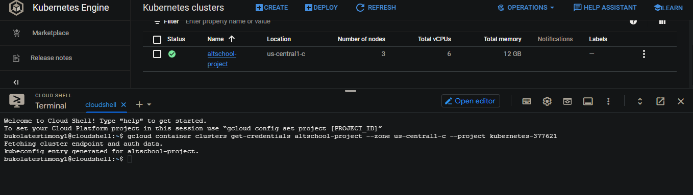

  # Google-kubernetes-mini-project

>  
<br>

- [OVERVIEW](#OVERVIEW) 
- [Process](#Process)
- [Links to files](#Links-to-files)
- [Author](#author)


<br>

## OVERVIEW
CREATING A WEB-DEPLOYMENT USING A DOCKER IMAGE ON GOOGLE KUBERNETES ENGINE (GKE).
> Kubernetes is an open-source platform that helps you orchestrate and manage your container infrastructure on-premises or in the cloud.

It automates the deployment, scaling, load balancing, logging, monitoring, and other management features of containerized applications. These are the features that are characteristic of typical platform-as-a-service solutions. Kubernetes also facilitates the features of infrastructure-as-a-service, such as allowing a wide range of user preferences and configuration flexibility.

Google Kubernetes Engine (GKE) is a managed Kubernetes service on Google infrastructure. GKE helps you to deploy, manage, and scale Kubernetes environments for your containerized applications on Google Cloud. 

<p>
In this write up, you are going to learn how to: 

- Build a simple personal website and package it in a container image based off of nginx.
- publish the image on the docker registry 
- create a deployment with the website image.
- Make it is publicly available.

</p>

<br>
<br>


## Process
- Build a simple personal website and package it in a container image based off of nginx.
- publish the image on the docker registry 
- Log in to your Google Cloud Platform account and navigate to the Kubernetes Engine in the left navigation panel.
- Click “Create cluster” and choose the “standard” option.
- Name your cluster and select your zone. 
- Leave the other default configurations and scroll down. Click “Create” to create the cluster. This takes a few minutes for the cluster to be provisioned.
- Once the cluster is running, connect to it using the Google Cloud Shell. 
- Now create your deployment using the web image
- Expose the deployment using a load balancer and a port.
- Finally, copy the external IP to your browser. If you are able to view your website, then your deployment was successful.

<br>
<br>


###  Links to files

- [Dockerfile](./My-prtfolio-website/Dockerfile)
- [Web-deployment file](https://github.com/Bukola-Testimony/Google-kubernetes-mini-project/blob/main/web-deployment.yml)
- [GKE manifest file](https://github.com/Bukola-Testimony/Google-kubernetes-mini-project/blob/main/gke-manifest.yaml)


<br>

## Build a simple personal website and package it in a container image based off of nginx.
For this project I already have a simple personal website pushed to github.
If you have a website pushed to github, simply clone it into your local work area.
in your terminal, cd into your cloned project and create a dockerfile

```console
touch Dockerfile
```

```console
nano Dockerfile
```
<br>

## Place the following code into the dockerfile, save and close: 

```console

FROM nginx:alpine

# set work directory
WORKDIR  /usr/share/nginx/html

# copy files into html directory
COPY  . .

# expose port 80 on the container
EXPOSE 80

```
## To build the image, run the following commands on your terminal:

```console

docker build -t portfolio . 
# Replace <portfolio> with any name of your choice. 
# Also include the dot at the end of the command

docker image ls
# To check your image 
 
```

## You can run the image in a detached mode and give it a port using the following command:

```console

docker run -dit -p 8000:80 portfolio
# Note: check your localhost:8000 to view your image.
 
```

### To push your image to Dockerhub.com. First rename the image and login to your dockerhub. Run the following commands:

```console

docker tag portfolio bukola01/portfolio
# Note: replace <bukola01> with your dockerhub username
docker login 
# Note this will prompt you to enter your username and password
docker push bukola01/portfolio
 
```


### The web image has been pushed to Dockerhub.com
> To pull the image at anytime, run the following command:

```console
docker pull bukola01/portfolio

```
<br>
<br>

### CREATE A DEPLOYMENT ON GOOGLE KUBERNETES ENGINE (GKE) WITH THE WEB IMAGE.

## step one
> Log in to your Google Cloud Platform account and navigate to the Kubernetes Engine in the left navigation panel.
Note: if this is your first time, you will be prompted to enable the Google kubernetes Engine API. Click on "OK" and wait for the API to be enabled.
<br>

> 

<br>
<br>

## step two
> Click “Create cluster” and choose the “standard” option.
<br>

> 
<br>

> 

<br>
<br>

## step three
> Name your cluster and select your zone. 
 Click “Create” to create the cluster. This takes a few minutes for the cluster to be provisioned.
<br>

> 

<br>
<br>

## step four
> Once the cluster is running, connect to it using the Google Cloud Shell
<br>

> 
<br>

> 

<br>
<br>

## step five
click on run in cloud shell and allow the environment to provision.
> 
<br>

> 

<br>
<br>

## step six
Enter the cloud authentication code already placed in your cloud shell area. This may ask for authentication, click ok.
Then configure your project ID. To do that, Follow the guide in the screenshots below.
> 
<br>

> 
<br>

> 

<br>
<br>


## step seven
Now create your deployment and expose it using the following commands.

```console
kubectl create deployment myweb --image=bukola01/portfolio
kubectl get deployment
kubectl expose deployment myweb --type=LoadBalancer --port=80
kubectl get service

```
> 

<br>
<br>

## step eight
Finally, copy the external IP only (without the port) to your browser. If are able to view your website, then your deployment was successful.

> 

## Congratulations! 

## Author

- Website - [Bukola Testimony](https://bukolatestimony.me)
- Twitter - [@BukolaTestimony](https://twitter.com/BukolaTestimony)
